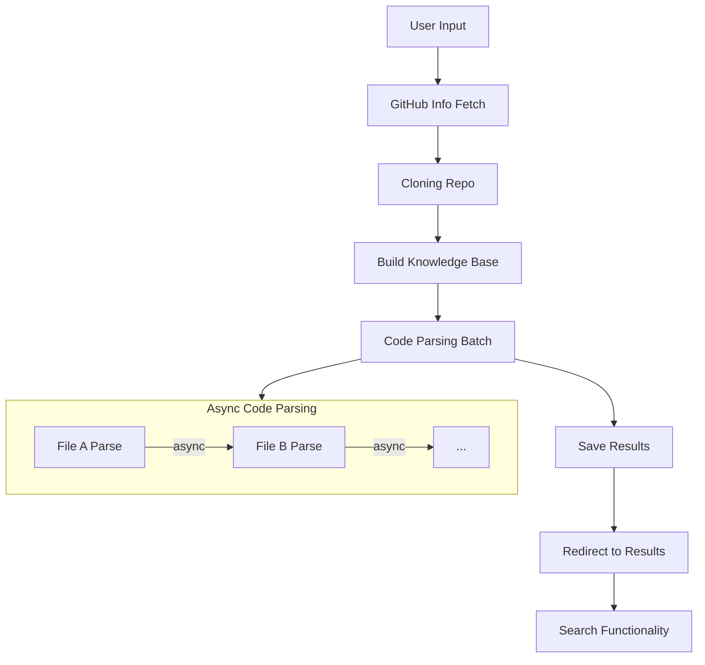

GitHub 代码仓库解析工具设计文档

## Project Requirements

本项目旨在构建一个完整的 GitHub 代码仓库解析系统，具备以下核心功能：

1. **获取仓库基础信息**：通过 GitHub API 获取描述、语言、创建时间、更新时间、语言统计、README 等。
2. **本地克隆与缓存**：将目标仓库 `git clone` 到本地，支持后续分析和复用。
3. **知识库构建**：基于 RAG 工具对本地仓库内容进行向量化处理，为 LLM 提供上下文检索能力。
4. **LLM 解析源码结构**：使用 OpenAI 的 LLM 模型自动分析源码文件，提取类/函数的 TITLE、DESCRIPTION、SOURCE（行号）、LANGUAGE、CODE。
5. **结果持久化保存**：以 Markdown 格式保存分析结果，并记录元数据用于后续查询与重分析。
6. **前端交互展示**：提供输入页面和结果展示页，支持全文搜索、跳转定位等功能。
7. **FastAPI 后端服务**：构建 RESTful 接口，提供分析触发、结果获取、历史记录管理等接口。

---

## Utility Functions

1. **GitHub API Client (`utils/github_client.py`)**
   - 封装 GitHub REST API 调用逻辑
   - 支持 token 认证、限流控制、错误重试机制

2. **Git Manager (`utils/git_manager.py`)**
   - 封装 `git clone`、清理缓存路径、权限管理
   - 使用唯一命名规则避免多用户冲突

3. **RAG Vector Store Provider (`utils/vectorstore_provider.py`)**
   - 定义统一接口抽象，支持多种 RAG 引擎（如 LangChain）
   - 实现源码切片策略（函数级/类级）

4. **LLM Parser (`utils/llm_parser.py`)**
   - 封装 OpenAI API 调用逻辑
   - 实现批量调用、缓存命中判断、prompt 统一模板

5. **Result Storage (`utils/result_storage.py`)**
   - 管理分析结果的目录结构与元信息记录
   - 支持 JSON/Markdown 双格式存储

6. **Search Engine (`utils/search_engine.py`)**
   - 提供关键词全文检索接口，支持按类名/函数名查询

7. **Frontend Templates (`templates/index.html`, `templates/results.html`)**
   - 展示首页输入框和解析后的内容页面
   - 支持语法高亮、行号显示、点击跳转

8. **Logger & Error Handler (`utils/logger.py`, `utils/error_handler.py`)**
   - 统一日志级别管理
   - 定义标准异常类型与捕获策略

---

## Flow Design

### 高层流程说明

整个应用由多个异步节点组成，包含串行执行、条件分支、子Flow嵌套等多种编排方式。整体流程如下：

1. **GitHubInfoFlow**：负责通过 GitHub API 获取基础信息。
2. **GitCloneNode**：将远程仓库克隆至本地。
3. **VectorizeRepoNode**：构建本地知识库。
4. **CodeParseBatchNode**：并行处理所有可解析文件，生成结构化信息。
5. **SaveResultsNode**：将结果写入磁盘并记录元信息。
6. **WebUIFlow**：提供前端展示与检索功能。

其中 CodeParseBatchNode 是性能关键节点，采用异步并行批处理模式实现高吞吐量。

---

### Flow Diagram



---

## Data Structure

共享内存 `shared` 结构定义如下：

```python
shared = {
    "repo_url": str,                        # 用户输入的 GitHub 地址
    "repo_info": {                          # 从 GitHub API 获取的基本信息
        "description": str,
        "language": str,
        "created_at": str,
        "updated_at": str,
        "languages": dict[str, int],        # GitHub API 返回的语言分布统计
        "readme": str                       # README 内容文本
    },
    "local_path": str,                      # 克隆后的本地路径
    "vectorstore_path": str,                # 构建完成的知识库文件路径
    "vectorstore_index": str,				# RAG API 索引名称
    "code_analysis": [                     # 每个文件的结构化解析结果
        {
            "file_path": str,               # 文件相对路径
            "functions": [
                {
                    "title": str,
                    "description": str,
                    "source": str,          # 包含文件名和行号，如 "main.py:10-20"
                    "language": str,
                    "code": str
                }
            ],
            "classes": [
                {
                    "title": str,
                    "description": str,
                    "source": str,
                    "language": str,
                    "code": str
                }
            ]
        }
    ],
    "result_filepath": str,                 # 最终保存的 Markdown 文件路径
    "analysis_time": str,                   # 分析完成时间戳
    "status": str                           # 流程执行状态：success / failed / processing
}
```

---

## Node Designs

### 1. GitHubInfoFetchNode
- **Purpose**: 获取 GitHub 仓库基本信息
- **Design**: `AsyncNode`, `max_retries=3`, `wait=10`
- **Data Access**:
  - Read: `shared.repo_url`
  - Write: `shared.repo_info`
- **Methods**:
  - `prep`: 校验 URL 格式，提取仓库 owner 和 repo 名称
  - `exec_async`: 调用 GitHub API 获取仓库详细信息
  - `post`: 更新 `shared.repo_info`，返回 `"default"`

---

### 2. GitCloneNode
- **Purpose**: 克隆远程仓库到本地缓存路径
- **Design**: `AsyncNode`, `max_retries=3`, `wait=15`
- **Data Access**:
  - Read: `shared.repo_url`
  - Write: `shared.local_path`
- **Methods**:
  - `prep`: 根据 repo_url 生成唯一命名的本地缓存路径
  - `exec_async`: 执行 `git clone` 命令，支持 HTTPS/SSH 方式配置
  - `post`: 若成功则设置 `shared.local_path`，失败时抛出 `GitCloneError`

---

### 3. VectorizeRepoNode
- **Purpose**: 对本地仓库构建向量知识库
- **Design**: `AsyncNode`, `max_retries=2`, `wait=30`
- **Data Access**:
  - Read: `shared.local_path`
  - Write: `shared.vectorstore_path`
- **Methods**:
  - `prep`: 扫描目录下所有可分析的源码文件（排除非源码文件）
  - `exec_async`: 使用 RAG 工具构建知识库
  - `post`: 设置 `shared.vectorstore_path`，便于后续 LLM 调用

---

### 4. CodeParsingBatchNode
- **Purpose**: 并行解析所有源码文件，提取结构化信息
- **Design**: `AsyncParallelBatchNode`, `batch_size=10`, `max_retries=2`, `wait=20`
- **Data Access**:
  - Read: `shared.vectorstore_path`, `shared.local_path`
  - Write: `shared.code_analysis`
- **Methods**:
  - `prep_async`: 为每个文件准备独立的上下文参数
  - `exec_async`: 调用 LLM 并结合知识库分析文件内容
  - `post_async`: 整理所有结果，更新 `shared.code_analysis`
- **Fallback**:
  - `exec_fallback_async`: 若解析失败，尝试降级为仅提取函数签名或简单注释

---

### 5. SaveResultsNode
- **Purpose**: 保存分析结果及元数据
- **Design**: `Node`
- **Data Access**:
  - Read: `shared.repo_info`, `shared.code_analysis`
  - Write: `shared.result_filepath`, 本地磁盘文件
- **Methods**:
  - `prep`: 根据仓库名和哈希生成文件夹路径
  - `exec`: 将分析结构转换为 Markdown 文本
  - `post`: 将结果写入磁盘，记录到索引文件中

---

### 6. WebUIFlow
- **Purpose**: 提供前端交互界面
- **Design**: `AsyncFlow`
- **嵌套节点**：
  - `/analyze`: 触发主分析流程（即以上 Flow）
  - `/results`: 查看已有分析记录
  - `/search`: 提供全文搜索接口
- **行为特征**：
  - `prep`: 接收浏览器请求
  - `exec`: 调用对应子 Flow 并等待结果
  - `post`: 渲染 HTML 页面并返回给客户端

---